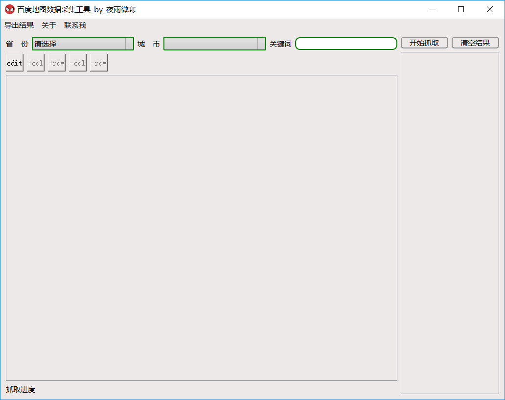
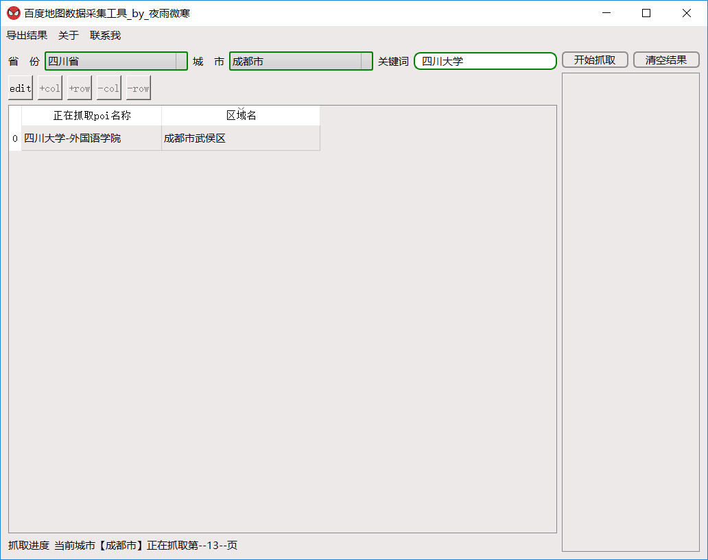
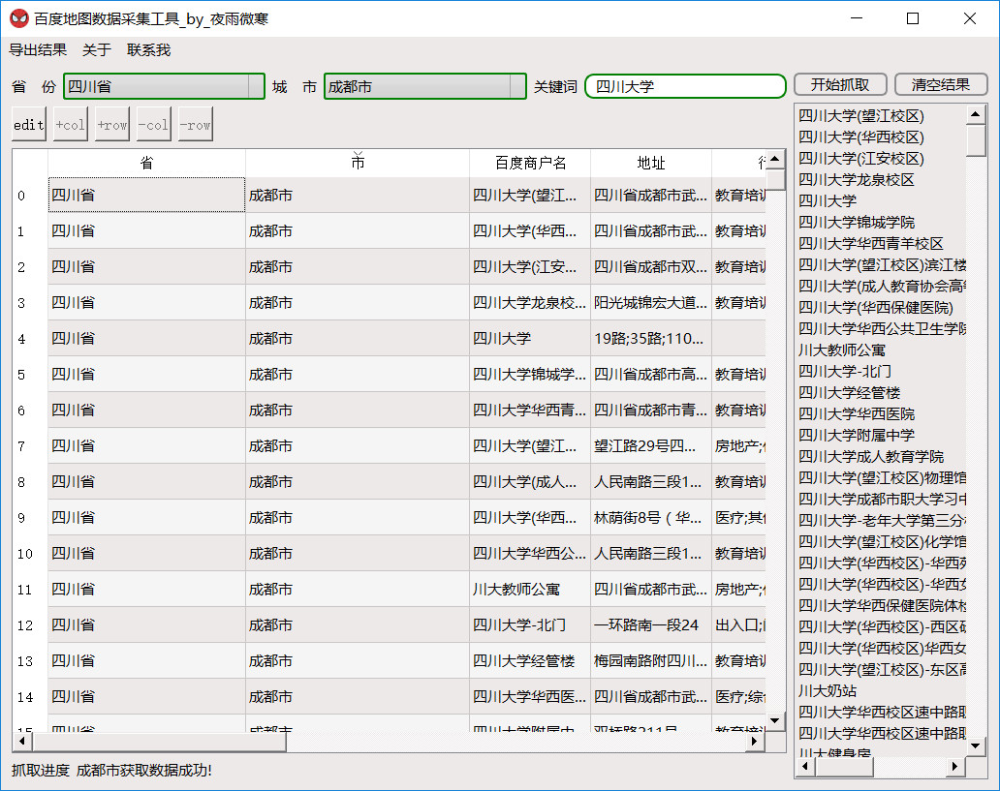
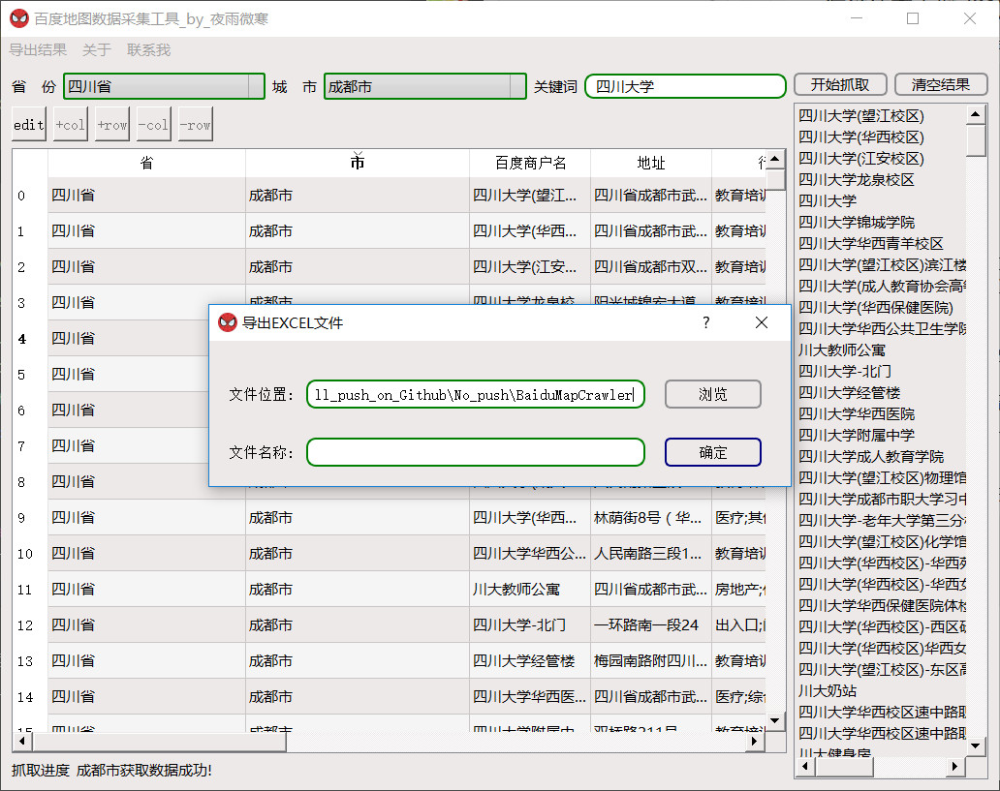

**1.功能：**

(1).根据关键词（街道、酒店或其他标志性建筑物等），查询周边的商户、酒店、交通位置等兴趣点  
(2).使用PyQt5可视化选择抓取选项与抓取结果并可以对抓取结果进行动态编辑  
(3).抓取结果导出为Excel表格  

**2.Requirements**

(1)pyhton3.5  
(2)pandas 0.20.3  
(3)PyQt5  
(4)修正过的qtpandas； 注：qtpandas在github上的最新版本代码有问题，需要修正，请下载本项目下修正过的qtpandas代码安装  

**3.使用说明**
(1)执行 python main.py，程序启动界面如下

(2)选择省、市，然后输入关键词，这里以在四川省成都市 四川大学为例

(3) 导出抓取结果为excel表格

